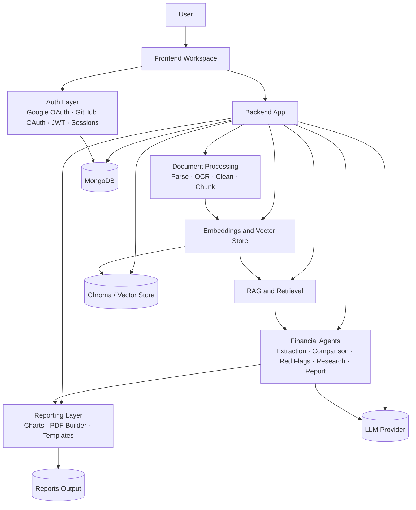
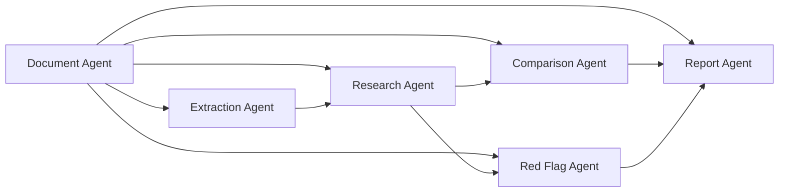
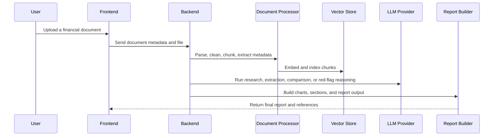

# AstraFinance-AI

<p align="center">
	
</p>

<p align="center">
	A documentation-first, multi-agent financial research platform that turns uploaded reports into searchable knowledge, cited answers, comparison outputs, red-flag insights, and polished reports.
</p>

<p align="center">
	<a href="#architecture">Architecture</a> ·
	<a href="#agent-system">Agents</a> ·
	<a href="#workflow">Workflow</a> ·
	<a href="#documentation-index">Documentation Index</a> ·
	<a href="#project-structure">Project Structure</a>
</p>

---

## What This Project Is

AstraFinance-AI is designed as a multi-agent financial research workspace for analysts, students, and teams who need to ingest large financial documents and interrogate them with confidence.

The system is centered around three principles:

1. Ground every answer in source evidence.
2. Split work across specialized agents instead of one monolithic assistant.
3. Make long-running document, embedding, and reporting pipelines visible to the user.

The repository currently combines:

- A backend application scaffold under `backend/app/`
- A frontend workspace scaffold under `frontend/`
- Documented architecture, flow, and design artifacts under `docs/`
- Scripts for ingestion, indexing, and seeding under `scripts/`
- Output and working folders such as `uploads/` and `reports/`

---

## Product Vision

The product is meant to answer financial research questions such as:

- What changed in this company’s annual report compared with last year?
- Which risks are new, unusually severe, or underexplained?
- What do the extracted financial metrics suggest about performance?
- Where in the source document is the evidence for this conclusion?

Instead of returning a single chatbot response, the platform decomposes the job into document ingestion, text normalization, chunking, retrieval, extraction, comparison, red-flag analysis, and report generation.

---

## Architecture



### Architecture Highlights

- Frontend focuses on the research workspace, onboarding, upload flows, and reporting surfaces.
- Backend is organized by feature area: auth, agents, API routes, document processing, embeddings, RAG, reporting, repositories, schemas, and services.
- Document ingestion is a first-class pipeline, not a hidden preprocessing step.
- Retrieval is citation-aware so responses can point back to the original source material.
- Reporting is treated as an output product, not just a downloaded artifact.

---

## Core Capabilities

### 1. Multi-Agent Research

The system distributes work across specialized agents so the model can focus on one type of reasoning at a time.

### 2. Document Understanding

Financial PDFs are parsed, cleaned, chunked, and embedded so they can be searched and reasoned over efficiently.

### 3. Company Comparison

The comparison flow is meant to show differences across companies, periods, or report versions with evidence-backed output.

### 4. Red Flag Detection

The risk workflow surfaces anomalies, omissions, and suspicious patterns that deserve closer inspection.

### 5. Research Assistant Experience

The research flow combines retrieval, prompt orchestration, and citations so the user can ask questions conversationally without losing traceability. Users can also directly attach files and images within the chat for dynamic multi-modal context.

### 6. Report Generation

Generated reports package findings into structured deliverables with charts, sections, and citation references.

### 7. Workspace-Based Organization

Users work inside dedicated workspaces that group documents, chats, metrics, comparisons, flags, and reports.

---

## Agent System



### Agent Roles

- Document Agent: handles ingestion, parsing, normalization, and indexing tasks.
- Extraction Agent: extracts structured financial metrics and entities from source material.
- Research Agent: answers research questions using retrieval and citation grounding.
- Comparison Agent: evaluates differences between companies, documents, or time periods.
- Red Flag Agent: detects anomalies, risks, inconsistencies, and disclosure issues.
- Report Agent: composes the final report artifact from the produced findings.

This division is important because each agent can use a narrower prompt, a narrower retrieval context, and a narrower output format.

---

## Workflow



### Document Pipeline

1. Upload file into a workspace.
2. Parse the document content.
3. Clean and normalize text.
4. Chunk the content into retrieval-ready segments.
5. Embed and store the chunks.
6. Run research, extraction, comparison, or red-flag workflows.
7. Build a report or answer with citations.

---

## User Experience Surface

The documented product experience spans:

- Landing page and onboarding
- Secure Authentication via Firebase (Email/Password, Google OAuth, GitHub OAuth)
- Dashboard and workspace overview
- Workspace list and creation
- Upload and document processing screens
- Chat, documents, metrics, comparison, red flags, agent activity, and reports tabs

The UI spec emphasizes:

- Trust-first messaging
- Clear status visibility for agent execution
- Transparent processing states for uploads and indexing
- Strong workspace boundaries for research context

---

## Documentation Index

The repository includes a broad documentation set split into dedicated folders under `docs/`. Use the links below as the central map for the project.

### Product and Requirements

- [PRD](docs/prd/)
- [Multiagent SRS](docs/diagrams/Mutiagent%20SRS.pdf)

### Architecture Folders

- [System Architecture](docs/architecture/) - System Architecture Diagram MultiAgent FRS.pdf
- [High Level Design](docs/HLD/) - High Level Diagram MultiAgent FRS.pdf
- [Low Level Design](docs/LLD/) - Low Level Design MultiAgent FRS.pdf
- [API Flow](docs/api/) - API flow Diagram.pdf
- [Database Architecture](docs/Database%20Architecture/) - Database Architecture Diagram.pdf
- [Multi-Agent Architecture](docs/Multiagent%20Architecture/) - Multi-Agent Architecture Diagram.pdf

### Supporting Workspaces

- [Setup Notes](docs/setup/) - currently empty placeholder folder
- [Design and documentation gallery](docs/diagrams/)

### Diagram Gallery

- [Authentication Flow Diagram](docs/diagrams/Authentication%20Flow%20Diagram.pdf)
- [Authentication Sequence Diagram - Google and GitHub OAuth to JWT to Session](docs/diagrams/Authentication%20Sequence%20Diagram%20%28GoogleGitHub%20OAuth%20%E2%86%92%20JWT%20%E2%86%92%20Session%29.pdf)
- [Company Comparison Sequence Diagram](docs/diagrams/Company%20Comparison%20Sequence%20Diagram.pdf)
- [Component Diagram - MultiAgent Financial Research System](docs/diagrams/Component%20Diagram%20%E2%80%93%20MultiAgent%20Financial%20Research%20System.pdf)
- [Database Architecture Diagram](docs/diagrams/Database%20Architecture%20Diagram.pdf)
- [Deployment Diagram](docs/diagrams/Deployment%20Diagram.pdf)
- [Design Document Volume 1](docs/diagrams/Design%20Document%20Volume%201.pdf)
- [Design Document Volume 2](docs/diagrams/Design%20Document%20Volume%202.pdf)
- [Design Document Volume 3](docs/diagrams/Design%20Document%20Volume%203.pdf)
- [Design Document Volume 4](docs/diagrams/Design%20Document%20Volume%204.pdf)
- [DFD Level 0 Diagram](docs/diagrams/DFD%20Level%200%20Diagram%20.png)
- [DFD Level 1 Diagram](docs/diagrams/DFD%20Level%201%20Diagram%20.png)
- [DFD Level 2 - Company Comparison](docs/diagrams/DFD%20Level%202%20%E2%80%94%20Company%20Comparison.png)
- [DFD Level 2 - Document Processing Pipeline](docs/diagrams/DFD%20Level%202%20%E2%80%94%20Document%20Processing%20Pipeline.png)
- [DFD Level 2 - Financial Extraction](docs/diagrams/DFD%20Level%202%20%E2%80%94%20Financial%20Extraction.png)
- [DFD Level 2 - Multi-Agent Processing](docs/diagrams/DFD%20Level%202%20%E2%80%94%20Multi-Agent%20Processing.png)
- [DFD Level 2 - RAG Pipeline](docs/diagrams/DFD%20Level%202%20%E2%80%94%20RAG%20Pipeline.png)
- [DFD Level 2 - Red Flag Detection](docs/diagrams/DFD%20Level%202%20%E2%80%94%20Red%20Flag%20Detection.png)
- [Document Upload and Indexing Sequence Diagram](docs/diagrams/Document%20Upload%20%26%20Indexing%20Sequence%20Diagram.pdf)
- [Level 2 Authentication Module](docs/diagrams/level%202%20Authentication%20Module.png)
- [RAG Pipeline Architecture - Production Level](docs/diagrams/RAG%20Pipeline%20Architecture%20%28Production-Level%29%20Diagram.pdf)
- [Red Flag Detection Sequence Diagram](docs/diagrams/Red%20Flag%20Detection%20Sequence%20Diagram.pdf)
- [Report Generation Flow Diagram](docs/diagrams/Report%20Generation%20Flow%20Diagram.pdf)
- [Report Generation Sequence Diagram](docs/diagrams/Report%20Generation%20Sequence%20Diagram.pdf)
- [Research Query Sequence Diagram - RAG Workflow](docs/diagrams/Research%20Query%20Sequence%20Diagram%20%28RAG%20Workflow%29.pdf)
- [Sequence Diagram - Document Upload and AI Research Workflow](docs/diagrams/Sequence%20Diagram%20%E2%80%93%20Document%20Upload%20%26%20AI%20Research%20Workflow.pdf)

### Additional Notes

- [Volume 2 Authentication, Dashboard, Workspace, and Document Management Notes](docs/diagrams/Volume-2-Auth-Dashboard-Workspace-Documents.md)
- The docs folder is organized by topic so each major system area can be reviewed in isolation.

---

## Project Structure

```text
AstraFinance-AI/
├── backend/
│   └── app/
│       ├── agent_memory/
│       ├── agents/
│       ├── api/
│       ├── auth/
│       ├── config/
│       ├── database/
│       ├── document_processing/
│       ├── embeddings/
│       ├── llm/
│       ├── middleware/
│       ├── models/
│       ├── rag/
│       ├── report/
│       ├── repositories/
│       ├── schemas/
│       ├── services/
│       └── utils/
├── frontend/
│   ├── app/
│   ├── components/
│   ├── lib/
│   └── public/
├── scripts/
├── docs/
├── datasets/
├── reports/
├── uploads/
└── tests/
```

### Backend Domain Map

- `agent_memory/`: shared state, conversation context, and memory coordination.
- `agents/`: specialized AI agent implementations.
- `api/`: route definitions for auth, comparison, research, report, upload, workspace, and related services.
- `auth/`: OAuth, JWT, and session handling.
- `database/`: collection definitions, indexes, seeding, and client setup.
- `document_processing/`: parsing, OCR, metadata extraction, chunking, and table extraction.
- `embeddings/`: embedding generation and vector-store integration.
- `llm/`: model access, provider orchestration, and prompt templates.
- `rag/`: retrieval, reranking, prompt building, citation generation, and response formatting.
- `report/`: charts, PDFs, report templates, and report services.
- `repositories/`: persistence abstraction layer.
- `schemas/`: request and response shapes.
- `services/`: business logic orchestration.
- `utils/`: reusable helpers, validation, logging, security, and shared constants.

---

## Status Notes

This repository currently reads as a structured product and documentation scaffold. Some runtime manifest files are intentionally minimal, so the README is written to reflect the documented system and directory architecture rather than claiming a fully wired deployment that is not present in the repo yet.

That makes the README useful in two ways:

- It documents the intended product surface and architecture in one place.
- It gives contributors a map of where each capability belongs in the codebase and documentation tree.

---

## How to Use This Repository

1. Read the product and architecture docs first to understand the design intent.
2. Use the diagram gallery for visual reference when implementing or reviewing flows.
3. Keep backend logic inside the relevant domain package instead of creating cross-cutting shortcuts.
4. Keep document-processing, retrieval, and reporting pipelines explicit and observable.
5. Preserve citation grounding in every user-facing research or report response.

---

## Contribution Mindset

- Prefer feature-local changes over broad rewrites.
- Keep the architecture aligned with the documented agent responsibilities.
- Update the README and docs whenever a new workflow, screen, or agent is added.
